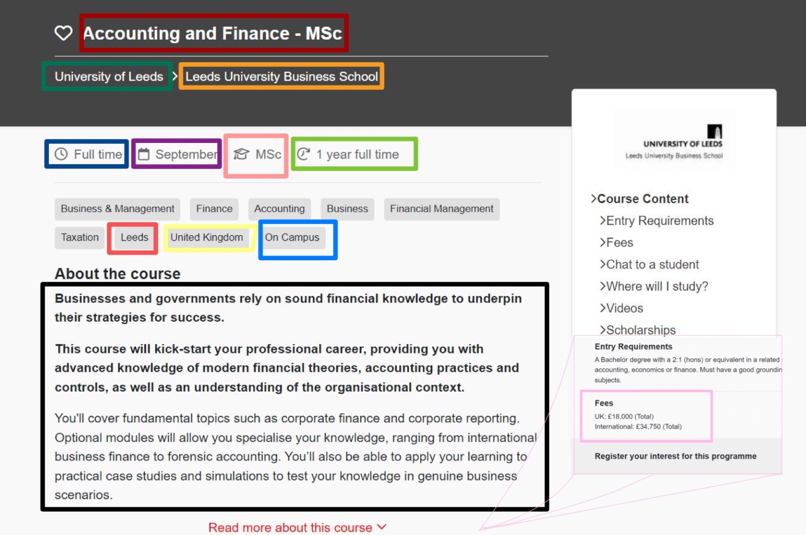
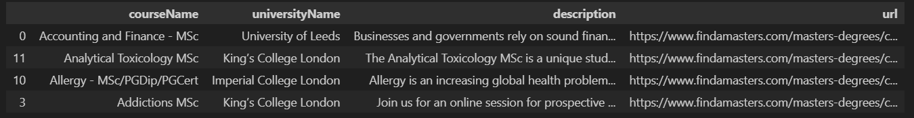
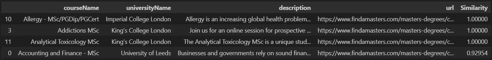

# Homework 3 - Master's Degrees from all over!


**Knowledge!**

Nowadays, society expects everyone, especially you, to have a decent level of knowledge from a relatively wide range of topics. To do so, as you are all doing here, most students choose, after finishing their undergraduate studies, to keep on studying. The natural next step is the Master's Degree!
You will be working with a [webpage](https://www.findamasters.com) that provides information and evalutation on many of these master's degrees in many universities worldwide.  

# VERY VERY IMPORTANT
1. **!!! Read the entire homework before coding anything!!!**
2. *My solution is not better than yours, and yours is not better than mine*. In any data analysis task, there **is no** unique way to answer. For this reason, it is crucial (**necessary and mandatory**) that you describe any single decision you take and all your steps.
3. Once solving an exercise, comments about the obtained results are **mandatory**. We are not always explicit about where to focus your comments, but we will always want brief sentences about your discoveries.
4. We encourage using chatGPT (Bard, Bing, or any other Large Language Models (LLM) chatbot tool) as allies to help you solve your homework, and we were hoping you could learn how to use them properly. However, **using such tools when not explicitly allowed will be considered plagiarism and strictly prohibited**. 

Now that it is all well settled, let's get on with it!

## 1. Data collection

For this homework, there is no provided dataset. Instead, you have to build your own. Your search engine will run on text documents. So, here
we detail the procedure to follow for the data collection. We strongly suggest you work on different modules when implementing the required functions. For example, you may have a ```crawler.py``` module, a ```parser.py``` module, and a ```engine.py``` module: this is a good practice that improves readability in reporting and efficiency in deploying the code. Be careful; you are likely dealing with exceptions and other possible issues! 

### 1.1. Get the list of master's degree courses

We start with the list of courses to include in your corpus of documents. In particular, we focus on web scrapping the [MSc Degrees](https://www.findamasters.com/masters-degrees/msc-degrees/). Next, we want you to **collect the URL** associated with each site in the list from the previously collected list.
The list is long and split into many pages. Therefore, we ask you to retrieve only the URLs of the places listed in **the first 400 pages** (each page has 15 courses, so you will end up with 6000 unique master's degree URLs).

The output of this step is a `.txt` file whose single line corresponds to the master's URL.

### 1.2. Crawl master's degree pages

Once you get all the URLs in the first 400 pages of the list, you:

1. Download the HTML corresponding to each of the collected URLs.
2. After you collect a single page, immediately save its `HTML` in a file. In this way, if your program stops for any reason, you will not lose the data collected up to the stopping point.
3. Organize the downloaded `HTML` pages into folders. Each folder will contain the `HTML` of the courses on page 1, page 2, ... of the list of master's programs.
   
__Tip__: Due to the large number of pages you should download, you can use some methods that can help you shorten the time. If you employed a particular process or approach, kindly describe it.
 
### 1.3 Parse downloaded pages

At this point, you should have all the HTML documents about the master's degree of interest, and you can start to extract specific information. The list of the information we desire for each course and their format is as follows:

1. Course Name (to save as ```courseName```): string;
2. University (to save as ```universityName```): string;
3. Faculty (to save as ```facultyName```): string
4. Full or Part Time (to save as ```isItFullTime```): string;
5. Short Description (to save as ```description```): string;
6. Start Date (to save as ```startDate```): string;
7. Fees (to save as ```fees```): string;
8. Modality (to save as ```modality```):string;
9. Duration (to save as ```duration```):string;
10. City (to save as ```city```): string;
11. Country (to save as ```country```): string;
12. Presence or online modality (to save as ```administration```): string;
13. Link to the page (to save as ```url```): string.
    
<p align="center">

</p>
This are the first rows of the scraped dataset:

<div style="overflow-x:auto;">
<table>
<thead>
  <tr>
    <th>index</th>
    <th>courseName</th>
    <th>universityName</th>
    <th>facultyName</th>
    <th>isItFullTime</th>
    <th>description</th>
    <th>startDate</th>
    <th>fees</th>
    <th>modality</th>
    <th>duration</th>
    <th>city</th>
    <th>country</th>
    <th>administration</th>
    <th>url</th>
  </tr>
</thead>
<tbody>
  <tr>
    <td>0</td>
    <td> Accounting and Finance - MSc</td>
    <td>University of Leeds</td>
    <td>Leeds University Business School</td>
    <td>Full time</td>
    <td>Businesses and governments rely on [...].</td>
    <td>September</td>
    <td>UK: £18,000 (Total) International: £34,750 (Total)</td>
    <td>MSc</td>
    <td>1 year full time</td>
    <td>Leeds</td>
    <td>United Kingdom</td>
    <td>On Campus</td>
    <td><a href="https://www.findamasters.com/masters-degrees/course/accounting-and-finance-msc/?i321d3232c3891">Link</a></td>
  </tr>
  <tr>
    <td>1</td>
    <td> Accounting, Accountability & Financial Management MSc</td>
    <td>King’s College London</td>
    <td>King’s Business School</td>
    <td>Full time</td>
    <td>Our Accounting, Accountability & Financial Management MSc course will provide [...].</td>
    <td>September</td>
    <td>Please see the university website for further information on fees for this course.</td>
    <td>MSc</td>
    <td>1 year FT</td>
    <td>London</td>
    <td>United Kingdom</td>
    <td>On Campus</td>
    <td><a href="https://www.findamasters.com/masters-degrees/course/accounting-accountability-and-financial-management-msc/?i132d7816c25522">Link</a></td>
  </tr>
  <tr>
    <td>2</td>
    <td> Accounting, Financial Management and Digital Business - MSc</td>
    <td>University of Reading</td>
    <td>Henley Business School</td>
    <td>Full time</td>
    <td>Embark on a professional accounting career [...].</td>
    <td>September</td>
    <td>Please see the university website for further information on fees for this course.</td>
    <td>MSc</td>
    <td>1 year full time</td>
    <td>Reading</td>
    <td>United Kingdom</td>
    <td>On Campus</td>
    <td><a href="https://www.findamasters.com/masters-degrees/course/accounting-financial-management-and-digital-business-msc/?i345d4286c351">Link</a></td>
  </tr>
  <tr>
    <td>3</td>
    <td> Addictions MSc</td>
    <td>King’s College London</td>
    <td>Institute of Psychiatry, Psychology and Neuroscience</td>
    <td>Full time</td>
    <td>Join us for an online session for prospective [...].</td>
    <td>September</td>
    <td>Please see the university website for further information on fees for this course.</td>
    <td>MSc</td>
    <td>One year FT</td>
    <td>London</td>
    <td>United Kingdom</td>
    <td>On Campus</td>
    <td><a href="https://www.findamasters.com/masters-degrees/course/addictions-msc/?i132d4318c27100">Link</a></td>
  </tr>
  <tr>
    <td>4</td>
    <td> Advanced Chemical Engineering - MSc</td>
    <td>University of Leeds</td>
    <td>School of Chemical and Process Engineering</td>
    <td>Full time</td>
    <td>The Advanced Chemical Engineering MSc at Leeds [...].</td>
    <td>September</td>
    <td>UK: £13,750 (Total) International: £31,000 (Total)</td>
    <td>MSc</td>
    <td>1 year full time</td>
    <td>Leeds</td>
    <td>United Kingdom</td>
    <td>On Campus</td>
  </tr>
  <!-- Add more rows here as needed -->
</tbody>
</table>
</div>


For each master's degree, you create a `course_i.tsv` file of this structure:

```
courseName \t universityName \t  ... \t url
```

If an information is missing, you just leave it as an empty string.


## 2. Search Engine

Now, we want to create two different Search Engines that, given as input a query, return the courses that match the query.

### 2.0 Preprocessing 

### 2.0.0)  Preprocessing the text

First, you must pre-process all the information collected for each MSc by:

1. Removing stopwords
2. Removing punctuation
3. Stemming
4. Anything else you think it's needed
   
For this purpose, you can use the [`nltk library](https://www.nltk.org/).

### 2.0.1) Preprocessing the fees column

Moreover, we want the field ```fees``` to collect numeric information. As you will see, you scraped textual information for this attribute in the dataset: sketch whatever method you need (using regex, for example, to find currency symbol) to collect information and, in case of multiple information, retrieve only the highest fees. Finally, once you have collected numerical information, you likely will have different currencies: this can be chaotic, so let chatGPT guide you in the choice and deployment of an API to convert this column to a common currency of your choice (it can be USD, EUR or whatever you want). Ultimately, you will have a ```float``` column renamed ```fees (CHOSEN COMMON CURRENCY)```.

### 2.1. Conjunctive query
For the first version of the search engine, we narrowed our interest to the __description__ of each course. It means that you will evaluate queries only concerning the course's description.

### 2.1.1) Create your index!

Before building the index, 
* Create a file named `vocabulary`, in the format you prefer, that maps each word to an integer (`term_id`).

Then, the first brick of your homework is to create the Inverted Index. It will be a dictionary in this format:

```
{
term_id_1:[document_1, document_2, document_4],
term_id_2:[document_1, document_3, document_5, document_6],
...}
```
where _document\_i_ is the *id* of a document that contains that specific word.

__Hint:__ Since you do not want to compute the inverted index every time you use the Search Engine, it is worth thinking about storing it in a separate file and loading it in memory when needed.

#### 2.1.2) Execute the query
Given a query input by the user, for example:

```
advanced knowledge
```

The Search Engine is supposed to return a list of documents.

##### What documents do we want?
Since we are dealing with conjunctive queries (AND), each returned document should contain all the words in the query.
The final output of the query must return, if present, the following information for each of the selected documents:

* `courseName`
* `universityName`
* `description`
* `URL`

__Example Output__ for ```advanced knowledge```: (please note that our examples are made on a small batch of the full dataset)

<p align="center">

</p>

If everything works well in this step, you can go to the next point and make your Search Engine more complex and better at answering queries.


### 2.2) Conjunctive query & Ranking score

For the second search engine, given a query, we want to get the *top-k* (the choice of *k* it's up to you!) documents related to the query. In particular:

* Find all the documents that contain all the words in the query.
* Sort them by their similarity with the query.
* Return in output *k* documents, or all the documents with non-zero similarity with the query when the results are less than _k_. You __must__ use a heap data structure (you can use Python libraries) for maintaining the *top-k* documents.

To solve this task, you must use the *tfIdf* score and the _Cosine similarity_. The field to consider is still the `description`. Let's see how.


#### 2.2.1) Inverted index
Your second Inverted Index must be of this format:

```
{
term_id_1:[(document1, tfIdf_{term,document1}), (document2, tfIdf_{term,document2}), (document4, tfIdf_{term,document4}), ...],
term_id_2:[(document1, tfIdf_{term,document1}), (document3, tfIdf_{term,document3}), (document5, tfIdf_{term,document5}), (document6, tfIdf_{term,document6}), ...],
...}
```

Practically, for each word, you want the list of documents in which it is contained and the relative *tfIdf* score.

__Tip__: *TfIdf* values are invariant for the query. Due to this reason, you can precalculate and store them accordingly.

#### 2.2.2) Execute the query

In this new setting, given a query, you get the proper documents (i.e., those containing all the query's words) and sort them according to their similarity to the query. For this purpose, as the scoring function, we will use the Cosine Similarity concerning the *tfIdf* representations of the documents.

Given a query input by the user, for example:
```
advanced knowledge
```
The search engine is supposed to return a list of documents, __ranked__ by their Cosine Similarity to the query entered in the input.

More precisely, the output must contain:
* `courseName`
* `universityName`
* `description`
* `URL`
* The similarity score of the documents with respect to the query (float value between 0 and 1)
  
__Example Output__ for ```advanced knowledge```:

<p align="center">

</p>

## 3. Define a new score!

Now it's your turn: build a new metric to rank MSc degrees.

Practically:

1. The user will enter a text query. As a starting point, get the query-related documents by exploiting the search engine of Step 2.1.
2. Once you have the documents, you need to sort them according to your new score. In this step, you won't have any more to take into account just the ```description``` field of the documents; you __can__ use also the remaining variables in your dataset (or new possible variables that you can create from the existing ones or scrape again from the original web-pages). You __must__ use a heap data structure (you can use Python libraries) for maintaining the *top-k* documents.

__N.B.:__ You have to define a __scoring function__, not a filter! 

The output, must contain:

* `courseName`
* `universityName`
* `description`
* `URL`
* The  __new__ similarity score of the documents with respect to the query

Are the results you obtain better than with the previous scoring function? **Explain and compare results**.

## 4. Visualizing the most relevant MSc degrees

Using maps can help people understand how far one university is from another so they can plan their academic careers more adequately. Here, we challenge you to show a map of the courses found with the score defined in point 3. You should be able to identify at least the *city* and *country* for each MSc degree. You can find some ideas on how to create maps in Python [here](https://plotly.com/python/maps/) and [here](https://towardsdatascience.com/visualizing-geospatial-data-in-python-e070374fe621) but you will maybe need further information for a proper visualization, like coordinates (latitude and longitude). You can retrieve this data using various tools:

1. [Here](https://medium.com/@manilwagle/geocoding-the-world-using-google-api-and-python-1f6b6fb6ca48) you can find a helpful tutorial on how to encode geo-informations using Google API in Python (this tool can also be used in [Google Sheets](https://handsondataviz.org/geocode.html))
2. You can collect a list of unique places in the format (City, Country) and ask chatGPT (or, as usual, any other LLM chatbot) to provide you with a list of corresponding representative coordinates
3. Explore and find the best solution for your case!
   
Once you defined your visualization strategy, include a way to encode fees in your charts. The map should show (with a proper legend) different courses and associated taxation: the user wants a glimpse not only of how far he will need to move but also of how much it will cost him!

## 5. BONUS: More complex search engine 

__IMPORTANT:__ This is a bonus step, so it's <ins>not mandatory</ins>. You can get the maximum score also without doing this. We will take this into account, **only if** the rest of the homework has been completed.

For the Bonus part, we want to ask you more sophisticated search engine. Here we want to let users issue more complex queries. The options of this new search engine are: 
1. Give the possibility to specify queries for the following features (the user should have the option to issue __none or all of them__): 
* `courseName`
* `universityName`
* `universityCity`
2. Specify a range for the __fees__ to retrieve only MSc whose taxation is in that range.
3. Specify a list of __countries__ which the search engine should only return the courses taking place in city within those countries.
4. Filter based on the courses that have already started. 
5. Filter based on the presence of online modality. 

__Note 1__: You should be aware that you should give the user the possibility <ins>to select any</ins> of the abovementioned options. How should the user use the options? We will accept __any manual__ that you provide to the user. 

__Note 2__: As you may have realized from __1st option__, you need to build <ins>inverted indexes</ins> for those values and return all of the documents that have the similarity <ins>more than 0</ins> concerning the given queries. Choose a __logical__ way to aggregate the similarity coming from each of them and explain your idea in detail.

__Note 3__: The options <ins>other than 1st</ins> one can be considered as __filtering criteria__ so the retrieved documents <ins>must respect all</ins> of those filters. 

The output must contain the following information about the places:

* `courseName`
* `universityName`
* `url`

## 6. Command Line Question

As done in the previous assignment, we encourage using the command as a feature that Data Scientists must master.

Note: To answer the question in this section, you must strictly use command line tools. We will reject any other method of response. The final script must be placed in CommandLine.sh.

First, take the course_i.tsv files you created in point 1 and merge them using Linux commands (Hint: make sure that the first row containing the column names appears only once).

Now that you have your merged file named merged_courses.tsv, use Linux commands to answer the following questions:
- Which country offers the most Master's Degrees? Which city?
- How many colleges offer Part-Time education?
- Print the percentage of courses in Engineering (the word "Engineer" is contained in the course's name).

__Important note:__ You may work on this question in any environment (AWS, your PC command line, Jupyter notebook, etc.), but the final script must be placed in CommandLine.sh, which must be executable. Please run the script and include a __screenshot__ of the <ins>output</ins> in the notebook for evaluation.

## 7. Algorithmic Question 
Leonardo is an intern at a company. He is paid based on the total number of hours he has worked. They agreed __d__ days ago that Leonardo could not work less than $minTime_i$ or more than $maxTime_i$ hours per <ins>i-th</ins> day. Furthermore, he was warned by HR that on his last day at the company, he should provide a detailed report on how many hours he worked <ins>each day</ins> for the previous d days.

Today is the day Leonardo should report to HR, but the problem is that he <ins>didn't</ins> account for how many hours he put in for each day, so he only has the __total sum of the hours__ ($sumHours$) he put in total in these d days. He believes that if he creates a report in which each number $dayHours_i$ corresponds to the __total hours he worked on the i-th day__ while satisfying the HR limitations and the total sum of all $dayHours_i$ equals $sumHours$, he would be fine.

He cannot create such a report independently and requests your assistance. He will give you the number of days $d$, total hours spent $sumHours$, and the HR limitations for each day $i$, and he wants you to assist him in determining whether it is possible to create such a fake report. If that is possible, make such a report. 

**Input**

The first line of input contains two integers __d__, $sumHours$ - the number of days Leonardo worked there and the total number of hours he worked for the company. Each of the following __d__ lines contains two integer numbers $minTime_i$ and $maxTime_i$ - the minimum and maximum hours he can work on the $i_{th}$ day. 

**Output**

If such a report cannot be generated, print 'NO' in one output line. If such a report is possible, print 'YES' in the output and d numbers - the number of hours Leonardo spent each day - in the second line. If more than one solution exists, print any of them. 

__Input 1__
```
2 5
0 1
3 5
```
__Output 1__
```
YES
1 4 
```
---
__Input 2__
```
1 1
5 6
```
__Output 2__
```
NO
```

1. Implement a code to solve the above mentioned problem. 

2. What is the __time complexity__ (the Big O notation) of your solution? Please provide a <ins>detailed explanation</ins> of how you calculated the time complexity.

3. Ask ChatGPT or any other LLM chatbot tool to check your code's time complexity (the Big O notation). Compare your answer to theirs. Do you believe this is correct? If the <ins>two differ</ins>, which one is right? (why?)
   
4. What do you think of the __optimality__ of your code? Do you believe it is optimal? Can you improve? Please <ins>elaborate</ins> on your response. 

